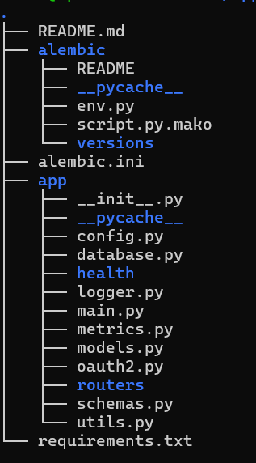

# FastAPI Production REST API

I've implemented:

FastAPI REST API with CRUD operations
PostgreSQL + SQLAlchemy ORM
Alembic for database version control and migrations
JWT Authentication & Authorization
Password hashing using bcrypt
Role-based resource ownership validation
Structured logging
Prometheus metrics for monitoring
Health check endpoint

## Folder structure

